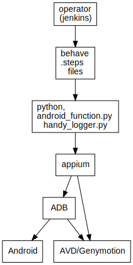
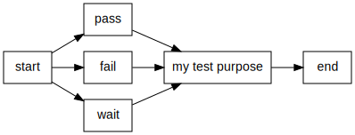

### PURPOSE

to test mobile apps of hk observatory environment:

- linux
- appium
- python 3.6.1, behave, python-appium-client

### TO SETUP:

```python
$ pip install -r requirements.txt
```

### TO EXECUTE:

```bash
$ virtualenv venv
$ source venv/bin/activate
```

### INSTALL PYTHON LIBRARIES:

```bash
$ pip install -r requirements.txt

# start appium -> connect to android / genymotion appium:

$ python behave
$ behave ./features/HKOApp_9DayForecast.feature
```

### setup stack on mac machine:

```bash
brew cask install visual-studio-code
brew install zsh-history-substring-search
brew install zsh
brew install zsh-lovers
brew install zsh-autosuggestions
brew install zsh-navigation-tools
brew install zsh-completions
brew install zsh-syntax-highlighting
brew install zsh-git-prompt
brew install zshdb
brew install git-flow
```

### DEMO:

passing example

### SYSTEM STRUCTURE:

- system structure:
  

- Behave grammer:
  
