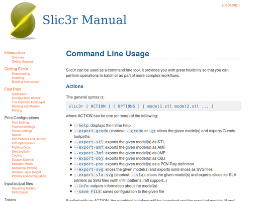

### WHAT IS IT ?:

An easy tool to export gcode from slic3r.

### BACKGROUND:

The option of slic3r command linx options wasn’t availabe under linux as described. The tools written to help perorming export 3mf -> save to stl -> export gcode as a batch operation.

### HOW TO USE:

- Clone repo:
- run under linux
- `git clone git@github.com:louiscklaw/slic3r_batch_export.git`
- pip install libxdo
- update the file list in:
- file_3mf_list # for the list of 3mf files
- WORKSPACE_DIR and PROJ_HOME
- SLIC3R_ACTIVE_CONFIG for slic3r configuration wanted
- SLIC3R_BIN_PATH for slic3r binary
- python batch_slic3r.py

### REFERENCES / REPOSITORIES:

- https://www.github.com/louiscklaw/slic3r_batch_export
