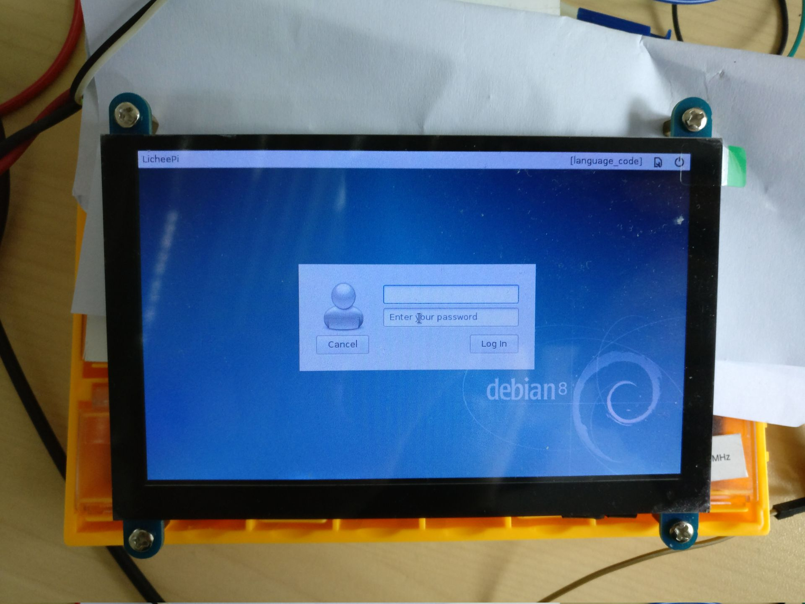

## PURPOSE:

This is a tryout of homemake embedded linux project using allwinner v3s chips inspired by https://www.reddit.com/r/electronics/comments/83141t/i_made_an_allwinner_v3s_evaluation_board_based/

## PROGRESS:

Currently in progress with the second try.

## THE SECOND TRY CHANGE LOG:

- fix SVREF wire
- 4k7 on SDIO CLK wire
- fix power facilities
- add GL827L sdcard reading facilities
- add ATMega328p for power and reset control
- add USB to serial

## BUILDROOT:

to setup ubuntu/docker for buildroot(tested under 18.04)

```bash
$ sudo apt-get install iputils-ping \
vim git wget xz-utils bzip2 \
gcc device-tree-compiler \
python python-dev time make pkg-config
```

## REFERENCES / REPOSITORIES:

- https://github.com/louiscklaw/allwinner-v3s-tryout
- https://www.reddit.com/r/electronics/comments/83141t/i_made_an_allwinner_v3s_evaluation_board_based/

## BOM/PART LIST:

To be updated
