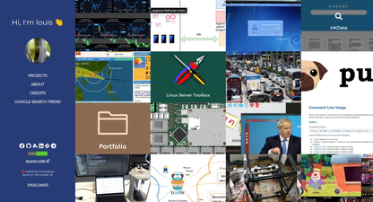
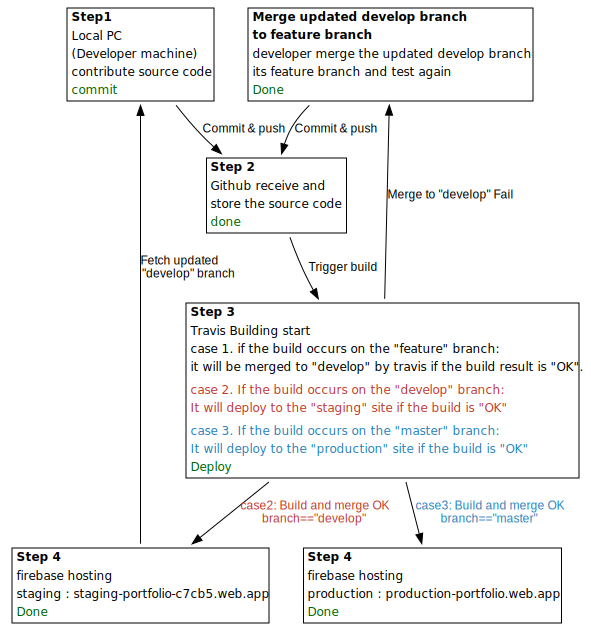
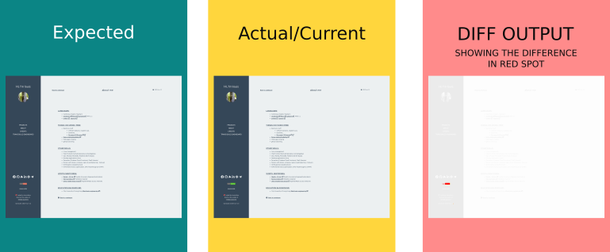

## BACKGROUND INFORMATION:

This is my portfolio. This website contains my project information.

## BUILD FLOW:

explain development flow here Build -> Test -> Merge -> Deploy

- Build
- Test

  - visual regression test
  - transverse to some key page of the site to get screenshot
  - compare with the expected one(which is last accepted screenshot)
  - if the error greater than threshold, regards as fail

- Merge
- Deploy




```bash
$ test/test.sh

```

### some information:

- production site: https://louiscklaw.github.io/

### references repositories:

- https://github.com/louiscklaw/portfolio-gatsby
